<h1 align="center">PRANTIK DATTA</h1>

  <strong>Data & Analytics Professional · Consultant · Author · Storyteller</strong>

<!-- 1. TYPING ANIMATION (SVG) -->
<!-- Generate your own text/colors here: https://readme-typing-svg.demolab.com -->

  

<!-- SOCIAL BADGES -->

  
  
  

---

### 🚀 *"Building data-driven solutions at the intersection of Analytics, AI, and FinTech."*

<!-- 2. WHO I AM + AT A GLANCE -->
<table>
<tr>
<td width="50%" valign="top">

## 👋 Who I Am

I'm **Prantik Datta**, a **Data Consultant with 5.8+ years** of experience in **Data Analytics & Consultant.**

I specialize in turning data into actionable insights, with experience across **consulting, data analytics, and business intelligence** including tools like **SQL, Power BI, Python, Excel, Prompt Engineering, AI Workflows/Automation, Workflow Design**. I work as a **freelance data consultant**, helping businesses make better, data-driven decisions.**

I'm currently exploring the **intersection of FinTech and AI**, while continuously learning new technologies and contributing to the data community.

</td>

<td width="50%" valign="top">

## ⚡ At a Glance

| | |
|---|---|
| **Name** | Prantik Datta |
| **Role** | Data Consultant |
| **Experience** | 5.8+ yrs |
| **Data** | SQL · Power BI · Python · Excel |
| **AI** | Prompt Engineering · AI Workflows |
| **Automation** | AI Automation · Workflow Design |
| **Build** | Vercel · Supabase · Antigravity |
| **Creative** | Video · Storytelling · Content |
| **Exploring** | AI · FinTech |

</td>

---

## 🔭 Currently Building & Learning

<table>
<tr>
<td width="50%" valign="top">

## 🛠️ Building

🤖 **NLP-to-SQL Query Agent**  
Exploring natural-language interfaces for querying databases with AI.

⚙️ **AI Automation Projects**  
Building practical automations around email, databases, job discovery, and content workflows.

🎨 **YouTube Thumbnail Creator**  
Experimenting with AI-assisted creative workflows for content creation.

📊 **Data & AI Projects**  
Working at the intersection of analytics, automation, and AI-powered applications.

</td>

<td width="50%" valign="top">

## 🌱 Learning & Exploring

💳 **FinTech**  
Currently in Phase 1 of my FinTech learning journey and creating content around what I learn.

🤖 **AI & Automation**  
Deepening my understanding of LLMs, prompt engineering, AI workflows, and automation.

🎬 **Video & Storytelling**  
Learning video creation, visual storytelling, and AI-assisted video generation.

✍️ **Writing & Poetry**  
Writing about daily experiences, observations, and poetry in my free time.

</td>
</tr>
</table>

---

## 🧰 Tech Stack

<!-- 4. ANIMATED SKILL ICONS -->
<!-- Full icon list & docs: https://github.com/tandpfun/skill-icons -->

<!-- Same icons, arranged as a table by category -->
| **📊 Data Analytics** |      |
|---|---|
| **🤖 AI & LLMs** |   |
|  **🚀 Building** |     |
| **☁️ Deploy & Backend** |    |
| **💻 Development** |     |
| **🎨 Design & Collaboration** |    |
| **📬 Connect** |   |

---

## 📊 GitHub Metrics

<picture>
  <source media="(prefers-color-scheme: dark)" srcset="./assets/overview.dark.svg">
  
</picture>

<picture>
  <source media="(prefers-color-scheme: dark)" srcset="./assets/contributions.dark.svg">
  
</picture>

### 🐍 Watch My Contributions Get Eaten

---
<h2 align="center">☕ Fuel the Next Idea</h2>

  

  

  Data · AI · Automation · Stories · Experiments

⭐️ *If you find my work useful, consider following or starring a repo.*
